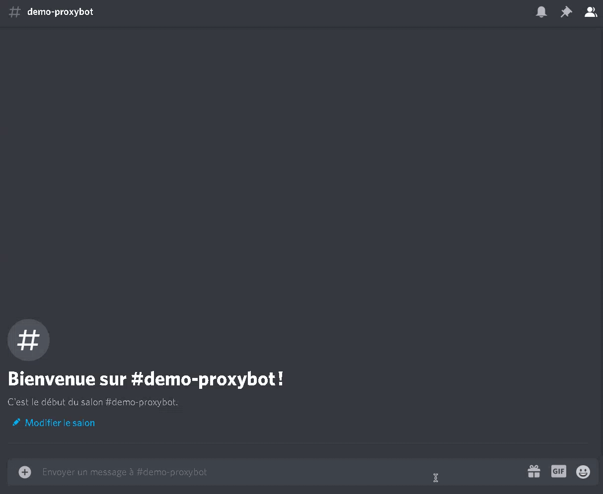

# proxy-bot
ProxyBot is a simple discord bot which scrapes proxies from the web!

# Useful links

Invite the official bot [here](https://discord.com/api/oauth2/authorize?client_id=809110849209106473&permissions=8&scope=bot) :) *Bot's prefix is `.`*

# Demo

# Usage
Before editing this source code, in order to follow GPL license, make sure to fork it and mention that it is open source please.

**Requirements**
- node.js
- npm
- python 2/3

**Usage**
1. clone this repository / download the files
2. run `npm i` to install necessary dependencies
3. edit `config.js` with your personnal details
4. run `node index.js` :)

# Issues and support
If you face any issue feel free to report it on github and join the support server!

# Credits
Proxyscrape [website](https://proxyscrape.com) for http/s and socks4 proxies.\
Hookzof's rotating [proxy list](https://github.com/hookzof/socks5_list) for socks5 proxies.
